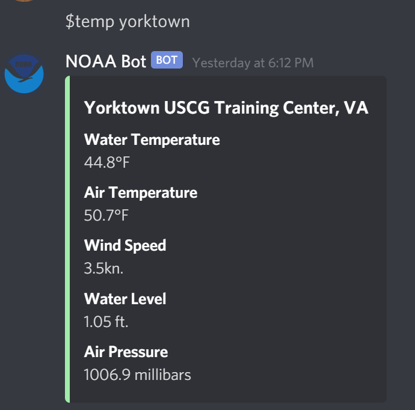
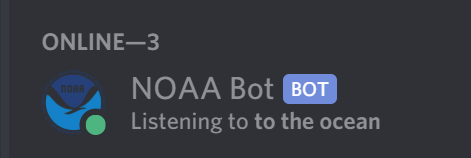

# noaaDiscordBot

This repository houses the NOAA discord bot used by the Capital Yacht club in Washington D.C. Originally intended to just return water temperatures for certain buoys the scope has expanded to include Water Temperature, Air Temperature, Wind Speed, Water Level, and Air Pressure. 

## How I built it
Due to a lack of available endpoints on the NOAA API, and the inavailablity of a free API that meets our needs, NOAA Bot uses **Selenium** Python module to scrape the websites of added buoys. It also uses the **Discord.<span></span>py** Python wrapper for Discord to send and receive information from Discord messages.

I created a Docker repository to house a prebuilt image of the NOAA bot.

## Usage

* **$temp [parameters]**  This command takes a paramter in the form of a number or string representing the name of a previously added buoy. 
* **$add [link] [name]** This command takes two parameters, in the form of a link and a name. The link represents the link of a buoy you wish to pull information from, the name being the shorthand you wish to refer to the buoy by in the ***$temp*** command.
* **$help** Help Command.


## Building

There are multiple ways to build this discord bot and run it on your own. This code is open source and can be used with credit.

1. Build from Docker image <br/>
    * This method should be used if you do not care about modifying the code and just wish to run the bot. 
    * Once installing Docker, pull the image from Docker hub using:<br/>
    ```bash
    docker pull mrchhaya/noaadiscord 
    ```
    * Create a container to run the image and you're done!
2. Build on your own.<br />
    * This method should be used if you wish to change the code. <br/>

    2a. Clone this repository<br/>

    2b. Install the required python modules using:
    ```bash
    pip install -r requirements.txt
    ```     
    2c. You need to create a 'secrets.env' file with these contents:
    ```
    DISCORD_TOKEN = {Discord Token}
    ```
    You can get the discord token from registering a discord application on the discord developers website.
    
    2d. Congrats! You are now ready to edit noaaBot.<span></span>py or run the discord bot. 

## Pictures:


